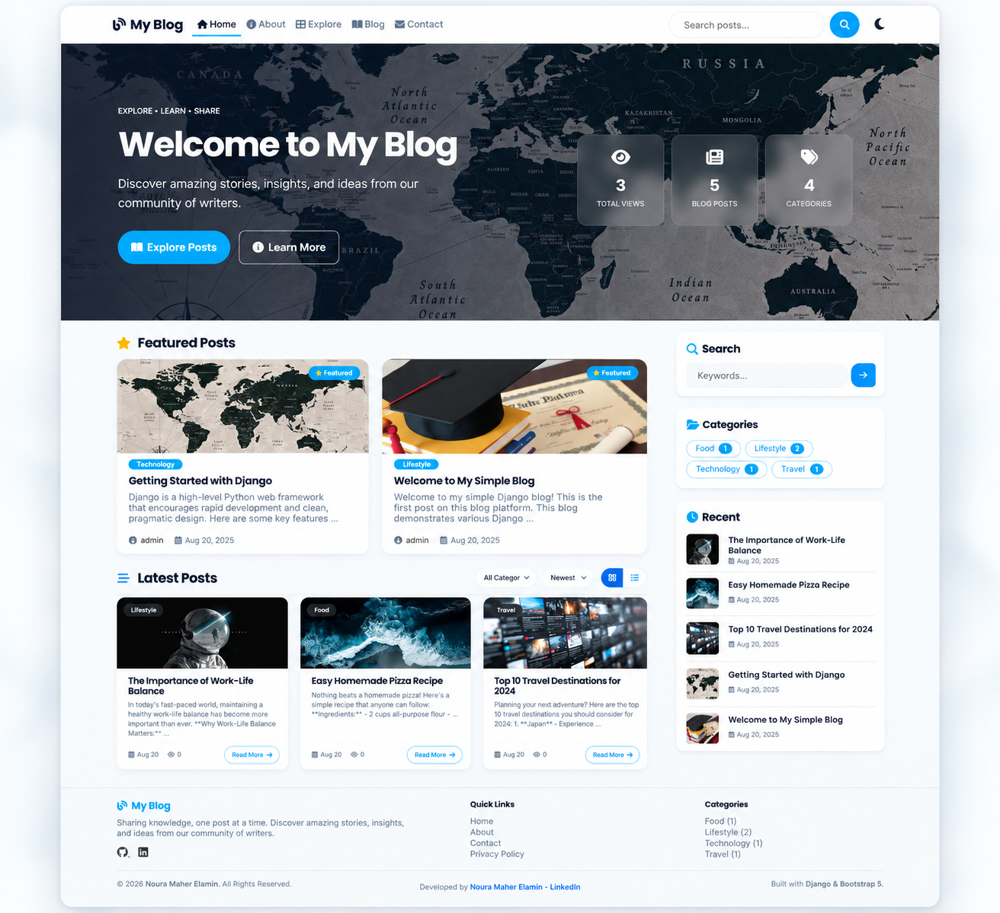

# Django Professional Blog

## Project Overview
A professional, fully-featured Full-Stack Django blog application designed for production. This project demonstrates strong backend architecture, a clean and responsive frontend, and practical implementations of real-world blog features. It serves as a modern, portfolio-ready blog website designed with a polished Bootstrap-style UI.

## Features
- Complete CRUD functionality for blog posts and categories.
- User authentication and author profiles.
- AJAX-powered post likes and search suggestions.
- Dynamic pagination and filtering (grid/list toggles).
- Comment system with rate limiting and moderation.
- Responsive, premium UI using Bootstrap 5 and custom CSS.
- Real-time statistics tracking for views, posts, and categories.
- SEO-friendly URLs and meta structures.

**Homepage — Wide View**


## Tech Stack
- **Backend**: Python, Django 5.2.5, SQLite (ready for PostgreSQL)
- **Frontend**: HTML5, CSS3, JavaScript, Bootstrap 5, Font Awesome
- **Other**: python-dotenv (environment variables)

## Project Structure
```text
Z5-Django Blog/
│
├── myproject/            # Main Django project configuration (settings, urls, wsgi)
├── blog/                 # Core application (models, views, forms, urls, admin, templatetags)
├── templates/            # HTML templates (base, home, post_detail, sidebar, etc.)
├── static/               # CSS, JS, and image assets
├── db.sqlite3            # Local development database
├── .env.example          # Environment variables template
├── requirements.txt      # Project dependencies
└── manage.py             # Django management script
```

## Installation
1. Clone the repository:
   ```bash
   git clone https://github.com/nouramaherelamin/django-blog.git
   ```
2. Navigate to the project directory:
   ```bash
   cd django-blog
   ```
3. Create a virtual environment:
   ```bash
   python -m venv venv
   ```
4. Activate the virtual environment:
   - Windows: `venv\Scripts\activate`
   - Unix/MacOS: `source venv/bin/activate`
5. Install dependencies:
   ```bash
   pip install -r requirements.txt
   ```

## Environment Variables
1. Copy the environment template file:
   ```bash
   cp .env.example .env
   ```
2. Update `.env` with your secure credentials:
   - `SECRET_KEY`: Your Django secret key.
   - `DEBUG`: Set to `True` for development, `False` for production.
   - `ALLOWED_HOSTS`: Comma-separated list of allowed domains.

## Database Setup
Run the following command to apply the database migrations and create the necessary tables:
```bash
python manage.py migrate
```

## Admin Setup
Create a superuser to access the Django admin panel and manage content:
```bash
python manage.py createsuperuser
```
Follow the prompts to set your username, email, and password.

## Sample Data
You can populate the database with sample categories and posts using the Django shell or through the Django admin interface. Note that statistics shown on the frontend (like total views) are dynamically calculated based on actual database entries.

## Running Locally
Start the development server:
```bash
python manage.py runserver
```
Access the application at `http://127.0.0.1:8000`.

## Testing
The project includes a comprehensive test suite covering models, views, AJAX endpoints, and forms.
To run tests:
```bash
python manage.py test
```

## Deployment Notes
The project is configured for professional deployment.
- Ensure `DEBUG=False` in `.env`.
- Collect static files: `python manage.py collectstatic`
- Configure your WSGI/ASGI server (e.g., Gunicorn).
- Use a production database like PostgreSQL instead of SQLite.

## Future Improvements
- Implement PostgreSQL for production.
- Add rich text editor for the admin panel.
- Implement user registration and profile management.
- Add social authentication (OAuth).

## Author
**Noura Maher Elamin**
- [GitHub](https://github.com/nouramaherelamin)
- [LinkedIn](https://www.linkedin.com/in/nouramaherelamin/)
